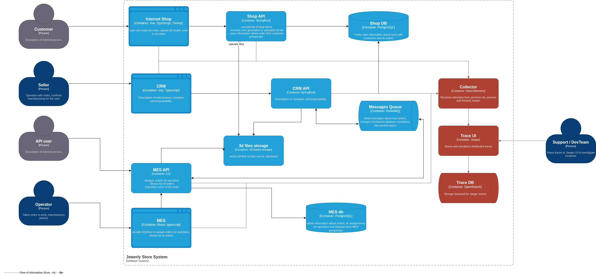

# Архитектурное решение по трейсингу

## 1. Анализ системы: точки, где заказ может «сломаться» или зависнуть

### Системы, которые необходимо покрыть трейсингом

- **Shop API** - точка входа для B2C-заказов, загрузка файлов.
- **CRM API** - маршрутизация заказов, подтверждение, связь с RabbitMQ.
- **MES API** - точка входа для B2B-заказов, расчёт стоимости, обновление статусов.
- **RabbitMQ** - центральный узел обмена сообщениями между CRM API и MES API.

### Данные, которые должны попадать в трейсинг

Для каждого span в трейсе должны фиксироваться:

**Обязательные атрибуты:**

- `trace_id` - сквозной идентификатор, единый для всего жизненного цикла заказа.
- `span_id` - идентификатор конкретной операции.
- `service.name` - имя сервиса.
- `operation` - имя операции.
- `duration` - длительность операции.
- `status` - результат (`OK`, `ERROR`).
- `error.message` - текст ошибки (при наличии).

**Бизнес-атрибуты:**

- `order.id` - идентификатор заказа.
- `order.status` - текущий статус заказа.
- `order.source` - источник заказа (`b2c`, `b2b`).
- `customer.id` - идентификатор клиента.

**Атрибуты для RabbitMQ-сообщений:**

- `messaging.destination` - имя очереди.
- `messaging.message_id` - идентификатор сообщения.

---

## 2. Мотивация

### Почему нужен трейсинг

Текущие проблемы, которые невозможно решить без трейсинга:

1. Определить, в каком сервисе находится заказ прямо сейчас.
2. Понять, на каком переходе заказ потерялся.
3. Измерить время обработки на каждом этапе.
4. Отличить проблему в коде от проблемы в инфраструктуре (БД, RabbitMQ, S3).

### Метрики, на которые повлияет внедрение трейсинга

**Технические метрики:**

1. Среднее время устранения инцидента.
2. Среднее время обнаружения проблемы.

**Бизнес-метрики:**

1. Процент потерянных заказов
2. Время выполнения заказа (order lead time)

---

## 3. Предлагаемое решение

### Новые компоненты

1. OpenTelemetry - принимает телеметрию от сервисов, обрабатывает ее и отправляет в Jaeger.
2. Jaeger - инстанс для хранения и визуализации трейсов.
3. OpenSearch - storage backend для Jaeger.

### Обновлённая C4-диаграмма

[Обновлённая диаграмма](jewerly_c4_model_tracing.drawio).

---

## 4. Компромиссы

### 4.1. Ручные операции

Некоторые переходы статусов зависят от действий людей. Время между этими действиями может составлять
часы или дни. Трейсинг здесь не покажет техническую проблему.

### 4.2. MES - купленный софт

MES куплен у стороннего поставщика, могут быть ограничения на интеграцию с OpenTelemetry.

---

## 5. Аспекты безопасности

### 5.1. Контроль доступа к Jaeger UI

- Доступ к Jaeger UI только для сотрудников компании с актуальной учётной записью.
- Авторизация: ограничение доступа по ролям (devops, dev).
- Сетевая изоляция.

### 5.2. Защита чувствительных данных в трейсах

- Маскирование чувствительных данных.
- Минимизация объёма данных в трейсе, чтобы не хранить избыточную информацию.

### 5.3. Безопасность транспорта

- Шифрование трафика.

### 5.4. Хранение и ротация

- Настроить retention policy, срок хранения трейсов ограничить 2-мя неделями.
