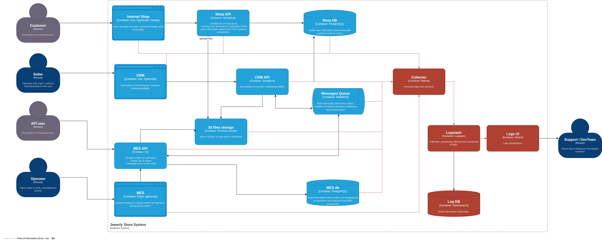

# Архитектурное решение по логированию

## 1. Анализ системы: какие логи нужно собирать

### Логи уровня INFO (бизнес-операции)

#### Shop API

| Событие                   | Данные для логирования                                                                        |
|---------------------------|-----------------------------------------------------------------------------------------------|
| Создание заказа           | `timestamp`, `order_id`, `customer_id`, `source`, `status`                                    |
| Загрузка 3D-файла         | `timestamp`, `order_id`, `customer_id`, `file_name`, `file_size_kb`, `storage_path`, `status` |
| Отправка заказа           | `timestamp`, `order_id`, `customer_id`, `status`                                              |
| Обновление статуса заказа | `timestamp`, `order_id`, `old_status`, `new_status`                                           |

#### CRM API

| Событие                         | Данные для логирования                                        |
|---------------------------------|---------------------------------------------------------------|
| Получение нового заказа         | `timestamp`, `order_id`, `customer_id`                        |
| Публикация сообщения в RabbitMQ | `timestamp`, `order_id`, `queue_name`, `message_id`, `action` |
| Получение сообщения из RabbitMQ | `timestamp`, `order_id`, `queue_name`, `message_id`, `action` |
| Обновление статуса заказа       | `timestamp`, `order_id`, `old_status`, `new_status`           |

#### MES API

| Событие                          | Данные для логирования                                                            |
|----------------------------------|-----------------------------------------------------------------------------------|
| Получение заказа через API (B2B) | `timestamp`, `order_id`, `user_id`                                                |
| Публикация сообщения в RabbitMQ  | `timestamp`, `order_id`, `queue_name`, `message_id`, `action`                     |
| Получение сообщения из RabbitMQ  | `timestamp`, `order_id`, `queue_name`, `message_id`, `action`                     |
| Начало расчёта стоимости         | `timestamp`, `order_id`, `file_path`                                              |
| Завершение расчёта стоимости     | `timestamp`, `order_id`, `calculated_price`, `calculation_duration_sec`, `status` |
| Обновление статуса заказа        | `timestamp`, `order_id`, `old_status`, `new_status`                               |

#### RabbitMQ

| Событие                                 | Данные для логирования                            |
|-----------------------------------------|---------------------------------------------------|
| Сообщение попало в dead-letter-exchange | `timestamp`, `queue_name`, `message_id`, `reason` |

### Другие уровни логирования

#### WARN

- **Повторная обработка сообщения** (retry) — `timestamp`, `order_id`, `queue_name`,
  `retry_attempt`, `max_retries`, `reason`.
- **Медленный SQL-запрос** (> 1 сек) — `timestamp`, `service`, `query_duration_ms`, `query` (с
  маскированием параметров).
- **Высокое время расчёта стоимости** (> 15 мин) — `timestamp`, `order_id`,
  `calculation_duration_sec`.

#### ERROR

- **Ошибка публикации сообщения в RabbitMQ** — `timestamp`, `order_id`, `queue_name`,
  `error_message`, `stack_trace`.
- **Ошибка обработки сообщения из RabbitMQ** — `timestamp`, `order_id`, `queue_name`, `message_id`,
  `error_message`, `stack_trace`.
- **Ошибка загрузки/скачивания файла из S3** — `timestamp`, `order_id`, `file_path`,
  `error_message`.
- **Ошибка расчёта стоимости** — `timestamp`, `order_id`, `error_message`, `stack_trace`.

---

## 2. Мотивация

### Почему нужно логирование

Текущие проблемы, которые невозможно решить без логирования:

1. Единая точка поиска при возникновении проблем.
2. Корреляция событий для восстановления причины.
3. История для ретроспективного анализа.

### Метрики, на которые повлияет внедрение логирования

**Технические:**

1. Среднее время расследования инцидента.
2. Кол-во незавершенных инцидентов.
3. Среднее время обнаружения проблемы.

**Бизнес:**

1. Ускорит время ответа клиентам о статусе их заказов.
2. Снизится нагрузка на поддержку, т.к. инструменты упростят поиск информации.

### Приоритет внедрения логирования и трейсинга по системам

Команда не может внедрить логирование и трейсинг во всех системах одновременно. Порядок
приоритизации:

| Приоритет | Система             | Обоснование                                                                                                                      |
|-----------|---------------------|----------------------------------------------------------------------------------------------------------------------------------|
| 1         | MES API             | Центральный узел проблем: расчёт стоимости (зависания), обмен с RabbitMQ (потеря сообщений), точка входа B2B (жалобы партнёров). |
| 2         | CRM API + RabbitMQ  | Второй участник обмена сообщениями.                                                                                              |
| 3         | Shop API            | Точка входа B2C. Менее критична, так как основные проблемы (потеря заказов, медленный дашборд) проявляются на стороне MES/CRM.   |
| 4         | Shop DB, MES DB, S3 | Требуется логи-е медленных запросов и возникающих ошибок.                                                                        |

---

## 3. Предлагаемое решение

[Обновлённая диаграмма](jewerly_c4_model_logging.drawio).

### Политика безопасности

**Чувствительные данные:**

- **Запрещено логировать:** не выполнять логирование персональных данных, паролей, токенов,
  содержимого 3D-файлов.
- **Маскирование:** настроить маскирование чувствительных данных.
- **Идентификаторы вместо данных:** использовать id вместо реальных данных.

**Контроль доступа:**
Настроить аунтеификацию и авторизацию для доступа к логам. Только поддержка и разработчики,
участвующие в расследовании, должны иметь доступ.

### Политика хранения

1. Отдельные индексы под каждую систему.
2. Retention: 14 дней для горячих данных, 90 дней для холодных.
3. Объем хранения: из расчета ср. размера лога в 1 KB и 10тыс. событий в день получаем следующий
   расчет. Горячее хранение: 1 * 10 000 * 14 = 140MB; холодное хранение: 1 * 10 000 * 90 = 900MB.
4. Ротация: ежедневная.

---

## 4. Единый формат логов и корреляция событий

### 4.1. Единый формат

Все сервисы пишут логи в структурированном JSON-формате с обязательным набором полей.

| Поле        | Тип    | Описание                                           |
|-------------|--------|----------------------------------------------------|
| `timestamp` | string | ISO 8601 с миллисекундами и UTC-смещением          |
| `level`     | string | `DEBUG`, `INFO`, `WARN`, `ERROR`                   |
| `service`   | string | Имя сервиса: `shop_api`, `crm_api`, `mes_api`      |
| `instance`  | string | Идентификатор EC2-инстанса                         |
| `trace_id`  | string | 32-символьный hex — сквозной идентификатор цепочки |
| `message`   | string | Человекочитаемое описание события                  |

Дополнительные поля добавляются в зависимости от контекста (см. таблицы раздела 1).

### 4.2. Корреляция событий между сервисами

Корреляция строится на сквозном `trace_id`, который создаётся при входе запроса в систему и
передаётся через все компоненты без изменений.

---

## 6. Система анализа логов: алертинг и обнаружение аномалий

### Алертинг

На основе логов необходимо настроить следующие алерты (через OpenSearch Alerting Plugin):

| Алерт                   | Условие                                                                | Severity | Действие                                                                 |
|-------------------------|------------------------------------------------------------------------|----------|--------------------------------------------------------------------------|
| Всплеск ошибок RabbitMQ | Количество ERROR-логов с `message` содержащим `rabbitmq` > 10 за 5 мин | Critical | Уведомление дежурного. Проверить доступность RabbitMQ и consumer-ов.     |
| Ошибки записи в БД      | Количество ERROR-логов с `db.operation` > 5 за 5 мин                   | Critical | Уведомление дежурного. Проверить состояние Shop DB / MES DB.             |
| HTTP 500 всплеск        | Количество логов с `status_code: 500` > 20 за 5 мин на одном сервисе   | Critical | Уведомление дежурного. Возможная причина: сбой после деплоя, перегрузка. |
| Медленные SQL-запросы   | Количество WARN-логов `slow_query` > 20 за 10 мин                      | Warning  | Создание тикета. Анализ запросов, оптимизация индексов.                  |

### Обнаружение аномалий

**Зачем:** стандартные пороговые алерты не улавливают плавную деградацию или необычные паттерны.
Примеры аномалий:

1. **Резкий рост количества заказов** — было 4 записи о создании заказов в секунду, стало 10 000.
   Возможные причины: DDoS, массовый retry B2B-партнёра, бот.
2. **Изменение паттерна ошибок** — обычно 2-3 ошибки в час, стало 50. Порог алерта ещё не достигнут,
   но тренд аномальный.
3. **Исчезновение логов от сервиса** — сервис перестал писать логи (упал, зависли).
