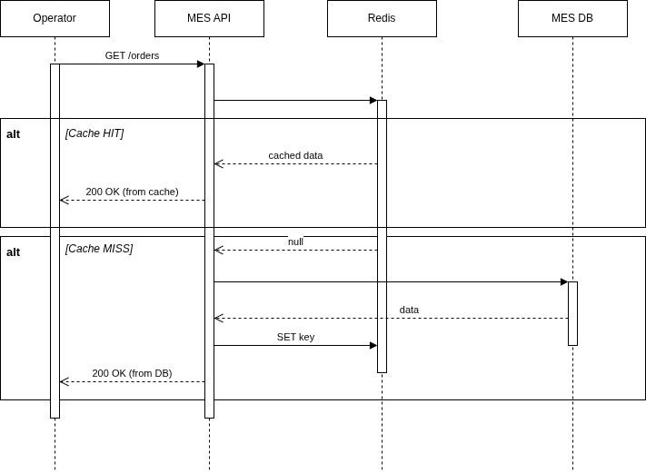
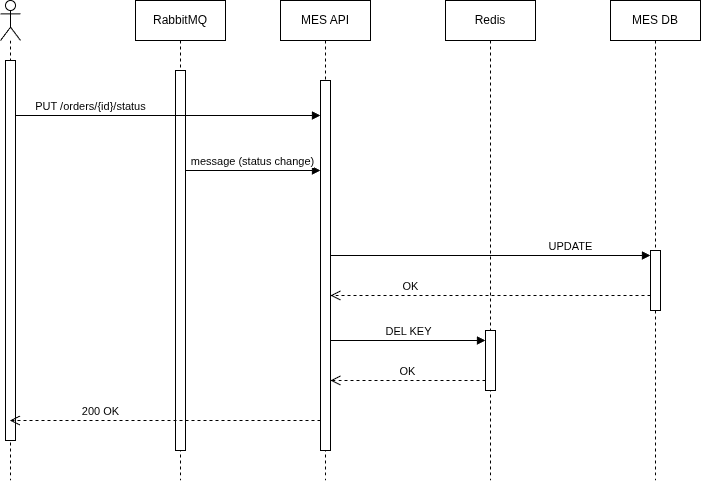

# Архитектурное решение по кешированию

## 1. Мотивация

### Проблемы, которые должно решить кеширование

Введение кэширование решит проблему долгой загрузки дашборда MES для операторов.

### Какие элементы системы включить в кеширование

Необходимо включить в кэширование список заказов по статусам, отображаемый на дашборде MES.

---

## 2. Предлагаемое решение

Клиентское кеширование не решает основную проблему - снижение нагрузки на MES DB. Для дашборда MES
критична консистентность между операторами. HTTP-кеш в браузере этого не обеспечивает. Поэтому
оптимальным решением будет использование server-side кеша.

### Выбор паттерна кеширования

#### Анализ паттернов

| Паттерн       | Подходит ли для MES-дашборда                                                           |
|---------------|----------------------------------------------------------------------------------------|
| Cache-Aside   | Полный контроль над логикой кеширования. Промах кеша не критичен - просто запрос в БД. |
| Write-Through | Не подходит. MES DB обновляется из разных источников.                                  |
| Refresh-Ahead | Избыточен. Требует фонового процесса обновления.                                       |

---

## 3. Диаграмма последовательности действий

### Чтение списка заказов (дашборд MES)



### Изменение статуса заказа (инвалидация кеша)



---

## 4. Структура ключей кеша

### Гранулярность хранения

Дашборд MES отображает список заказов, сгруппированных по статусам. Кеш хранится на уровне
статуса: ключ включает в себя список всех заказов в опред-ом статусе.

### Схема ключей

```
mes:orders:status:{status}

(e.g. `mes:orders:status:new`)
```

---

## 6. Стратегия инвалидации кеша

### Какие ключи инвалидируются и когда

При изменении статуса заказа с `old_status` на `new_status` инвалидируются два ключа:

```
DEL mes:orders:status:{old_status}
DEL mes:orders:status:{new_status}
```

### Источник 1: изменение статуса через API

Инвалидация происходит в сервисе после успешного коммита в БД.

### Источник 2: изменение статуса через RabbitMQ

Инвалидация происходит в сервисе после получения сообщ-я от RabbitMQ.

